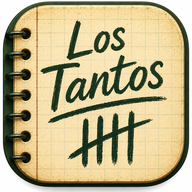
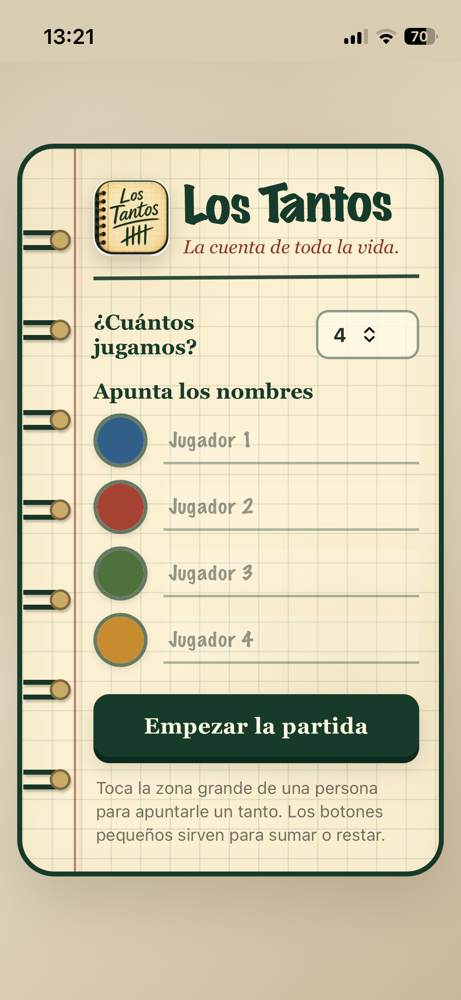
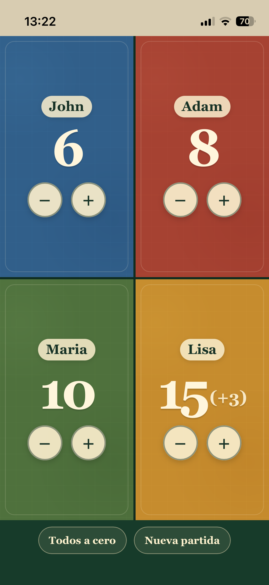
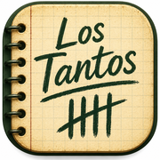

# Los Tantos - La app para "apunta ahí!"

**Los Tantos** es una pequeña aplicación web para llevar la puntuación de partidas de cartas, juegos de mesa o cualquier juego en el que varias personas o equipos necesiten ir sumando y restando puntos.

Está pensada para ser muy sencilla de usar, especialmente en partidas familiares: se abre, se indican los participantes y el resto de la pantalla se convierte en un marcador grande y fácil de pulsar.

## Funcionalidades

- Permite elegir entre **2 y 8 participantes**.
- Cada participante puede tener su propio **nombre**.
- La aplicación asigna automáticamente un **color** a cada participante, que puede modificarse antes de empezar.
- Al iniciar la partida, la pantalla se divide automáticamente entre todos los participantes para aprovechar al máximo el espacio disponible.
- Cada zona muestra el **nombre** del participante y su **puntuación actual**.
- Tocar la zona grande de un participante suma **1 punto**.
- Los botones `−` y `+` permiten restar o sumar puntos de forma explícita.
- Después de modificar una puntuación, se muestra temporalmente el cambio acumulado, por ejemplo:
  - `23 (+2)` si se han añadido 2 puntos.
  - `18 (-3)` si se han restado 3 puntos.
- Ese indicador se mantiene durante **5 segundos desde la última modificación**. Después desaparece y el siguiente cambio empieza un nuevo contador.
- Al crear una nueva partida se conserva en el dispositivo la **última configuración de participantes y nombres**, para no tener que escribirlos de nuevo.
- Las puntuaciones de una partida **no se guardan** al cerrar la aplicación.
- Funciona como **PWA (Progressive Web App)** y puede utilizarse sin conexión después de haberse cargado correctamente al menos una vez.

### Interfaz de usuario
<table><tr><td></td><td></td></tr></table>

## Instalación en iPhone como PWA

Los Tantos no necesita instalarse desde la App Store. Puede añadirse directamente a la pantalla de inicio del iPhone y abrirse como una aplicación independiente.

### 1. Abre Los Tantos en Safari

En el iPhone, abre **Safari** y entra en la dirección web donde está publicada la aplicación:

```text
https://aritzita.github.io/los-tantos/
```

> Para instalarla como PWA es importante abrirla desde **Safari** y desde una dirección web publicada mediante HTTPS.

### 2. Añádela a la pantalla de inicio

Con Los Tantos abierto en Safari:

1. Pulsa el botón **Compartir**.
2. Desplázate por las opciones y pulsa **Añadir a pantalla de inicio**.
3. Activa la opción **Abrir como app web**.
4. Comprueba que el nombre sea **Los Tantos**.
5. Pulsa **Añadir**.

Si no aparece la opción **Añadir a pantalla de inicio**, desplázate hasta el final del menú, entra en **Editar acciones** y añádela.

### 3. Abre Los Tantos desde su icono

El icono de **Los Tantos** aparecerá en la pantalla de inicio del iPhone.



A partir de ese momento puedes abrirlo directamente desde ese icono. La aplicación se mostrará a pantalla completa, sin la interfaz habitual del navegador, de forma similar a una app instalada desde la App Store.

## Uso sin conexión

Los Tantos incluye un *service worker* que guarda localmente los archivos necesarios de la aplicación.

Para asegurarte de que funciona sin conexión:

1. Abre Los Tantos desde su icono mientras tengas conexión a Internet.
2. Déjala cargar completamente al menos una vez.
3. A partir de entonces debería poder abrirse y utilizarse aunque el iPhone no tenga conexión.

Los datos almacenados en el propio dispositivo, como la última configuración de participantes y nombres, son independientes del repositorio de GitHub.

## Archivos principales

```text
index.html
manifest.webmanifest
sw.js
icons/
```

- `index.html`: interfaz y funcionamiento de la aplicación.
- `manifest.webmanifest`: información utilizada para instalar Los Tantos como PWA.
- `sw.js`: permite almacenar los archivos necesarios para el funcionamiento sin conexión.
- `icons/`: iconos utilizados por la PWA y por la pantalla de inicio del iPhone.

## Privacidad

Los Tantos no necesita cuentas de usuario, base de datos ni servidor de aplicación.

Los nombres introducidos y la configuración que se conserva se almacenan **localmente en el navegador del dispositivo** y no se envían al repositorio de GitHub.

## Compatibilidad

La aplicación está diseñada principalmente para **iPhone**, aunque al ser una aplicación web también puede abrirse desde navegadores modernos en ordenadores, tablets y otros teléfonos.

## Referencia para la instalación en iPhone

Apple explica el procedimiento para convertir un sitio web en una app desde Safari en su documentación oficial:

https://support.apple.com/es-es/guide/iphone/iphea86e5236/ios

---

Proyecto personal para partidas familiares.
